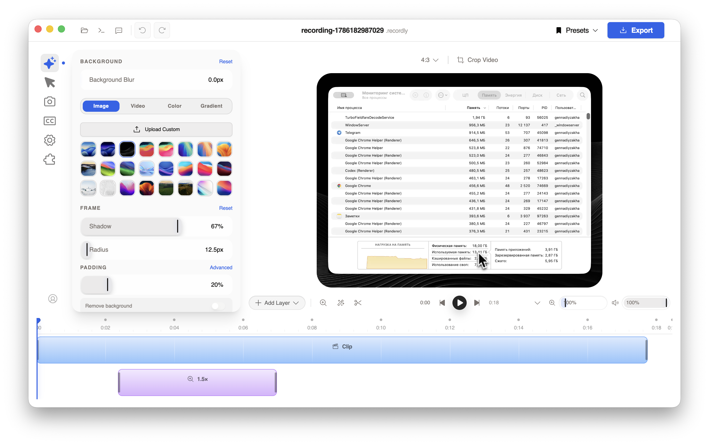
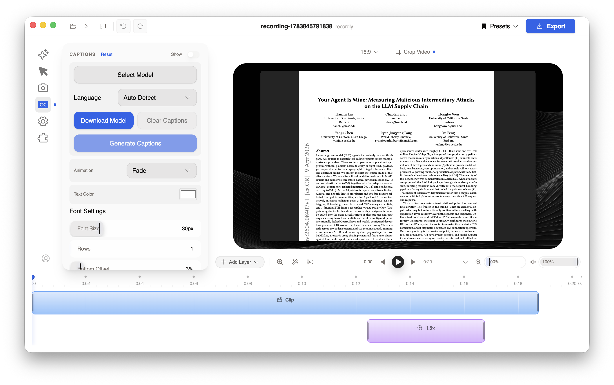

<div align="center">
  

  # Screendance App

  **Record your screen. Shape the story. Export it beautifully.**

  A native-first screen recorder and video editor built for macOS — with smooth zooms,
  polished backgrounds, captions, webcam layouts, and production-ready exports.

  [](https://www.apple.com/macos/)
  [](#download)
  [](#download)
  [](CHANGELOG.md)
  [](LICENSE.md)

  [Website](https://globa-me.github.io/Screendance-App/) ·
  [Downloads](https://github.com/globa-me/Screendance-App/releases) ·
  [Changelog](CHANGELOG.md) ·
  [Report an issue](https://github.com/globa-me/Screendance-App/issues)

  **Support independent GZ Apps development**

  Get ready-to-run builds, updates, and member posts while helping me improve this project.

  [](https://www.patreon.com/c/globa_me)
  [](https://boosty.to/globa_me)
</div>

<br />

<p align="center">
  
</p>

## Make screen recordings feel finished

Screendance turns a raw capture into a presentation-ready video without sending
your recording to a browser editor. Capture with macOS ScreenCaptureKit, refine
the result on a visual timeline, and export in the format your work needs.

| Capture with confidence | Edit without the clutter | Export for any canvas |
| :--- | :--- | :--- |
| Record a display, window, microphone, system audio, and webcam with native macOS capture. | Add automatic or manual zooms, backgrounds, framing, captions, cuts, and webcam overlays. | Create landscape, square, or portrait video — including transparent WebM and ProRes 4444. |

## Highlights

- **Native macOS recording** — ScreenCaptureKit capture tuned for Apple Silicon and Intel Macs.
- **Automatic focus** — turn clicks and cursor movement into smooth, editable zooms.
- **A clean visual editor** — style backgrounds, padding, corners, shadows, crop, and layout from one workspace.
- **Local captions** — generate subtitles with downloadable Whisper models and keep media on your Mac.
- **Flexible audio** — record system sound and an external microphone, with live level indicators and fallback recovery.
- **Professional export** — MP4, GIF, transparent WebM, and Quick Look-safe ProRes 4444 workflows.
- **Reusable projects** — save work as `.scrdance`; existing `.recordly` projects remain supported.
- **Ten interface locales** — English, French, Italian, Spanish, Brazilian Portuguese, Dutch, Korean, Russian, Simplified Chinese, and Traditional Chinese.

## See it in action

<table>
  <tr>
    <td width="50%">
      
      <br />
      <sub><b>Style the frame</b> — images, video, color, gradients, blur, padding, corners, and shadows.</sub>
    </td>
    <td width="50%">
      
      <br />
      <sub><b>Add captions locally</b> — choose a model, detect language, and tune the final look.</sub>
    </td>
  </tr>
</table>

## A simple workflow

1. **Choose what to capture.** Pick a screen or window, then select microphone, system audio, and webcam options.
2. **Record naturally.** Screendance captures cursor movement and interaction data alongside the video.
3. **Shape the result.** Trim the recording, adjust the canvas, edit zooms, add captions, and arrange overlays.
4. **Export and share.** Choose a resolution, frame rate, quality, and format for the final file.

## Download

Screendance supports **macOS 14 or newer** with separate builds for:

- **Apple Silicon (`arm64`)** — M1, M2, M3, M4, and newer Apple chips.
- **Intel (`x64`)** — supported Intel-based Macs.

Version 1.1.0 has signed, notarized local distribution candidates, but no compiled
build has been published to GitHub Releases yet. When a public build is available,
download it only from the official [Releases page](https://github.com/globa-me/Screendance-App/releases).

After downloading, open the DMG, drag **Screendance App** to `Applications`, and
grant the macOS permissions needed for the features you use: Screen & System Audio
Recording, Accessibility, Microphone, and Camera.

## Build from source

### Requirements

- macOS 14 or newer
- Node.js 22 LTS and npm
- Xcode Command Line Tools
- CMake for clean dual-architecture Whisper runtime builds

```bash
git clone https://github.com/globa-me/Screendance-App.git
cd Screendance-App
git switch screendance/macos-apple-silicon
npm ci
npm run dev
```

To build signed `arm64` and `x64` packages on a configured development Mac:

```bash
npm run build:mac
```

See the [macOS distribution guide](docs/releasing/macos-signing.md) for signing,
notarization, architecture checks, and release finalization.

## Technology

Screendance combines Electron, React, TypeScript, Vite, FFmpeg, WebCodecs,
ScreenCaptureKit, AVFoundation, and Swift helpers. Recording and editing happen
locally; downloadable Whisper models power on-device caption generation.

<details>
<summary><b>Repository map</b></summary>

<br />

| Path | Responsibility |
| :--- | :--- |
| `electron/` | Main process, IPC, media serving, recording, export, and native integration |
| `electron/native/` | Swift capture, window, cursor, and native monitoring helpers |
| `src/components/video-editor/` | Editor UI, timeline, playback, project state, and export controls |
| `src/hooks/useScreenRecorder.ts` | Renderer-side recording orchestration |
| `src/lib/exporter/` | Rendering, encoding, muxing, and export pipeline |
| `scripts/` | Native builds, packaging, smoke checks, and release tooling |

</details>

<details>
<summary><b>ProRes alpha compatibility note</b></summary>

<br />

Apple preview apps can show a black matte even when FFmpeg reports a valid alpha
plane. The known-good path uses QuickTime `.mov`, `prores_ks`, ProRes 4444
(`ap4h`), an alpha-capable pixel format, BT.709 metadata, and FFmpeg's default
`FFMP` vendor. Do not force `apl0`.

Maintainers should read the full guardrail in [AGENTS.md](AGENTS.md) before
changing ProRes export or transcoding behavior.

</details>

## Project status

The current development branch includes transparent export, resilient external
microphone selection, recording diagnostics, configurable zoom behavior, smoother
preview rendering, global recording shortcuts, dual-architecture macOS packaging,
and refreshed localization. See the [changelog](CHANGELOG.md) for the detailed history.

## Credits

Screendance App is a macOS-focused fork of
[Recordly](https://github.com/webadderallorg/Recordly), created from Recordly
commit [`67a83ca`](https://github.com/webadderallorg/Recordly/commit/67a83ca).
Recordly and its contributors remain credited as the original project.

## License

Distributed under the [GNU Affero General Public License v3](LICENSE.md), including
the attribution and branding requirements inherited from Recordly.

<div align="center">
  <br />
  <b>Built for creators who want polished screen video without leaving the Mac.</b>
</div>
