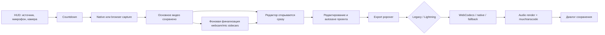
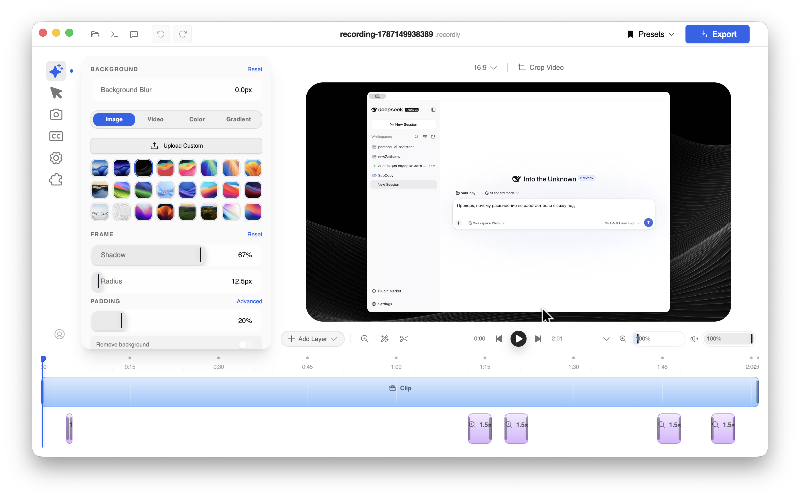
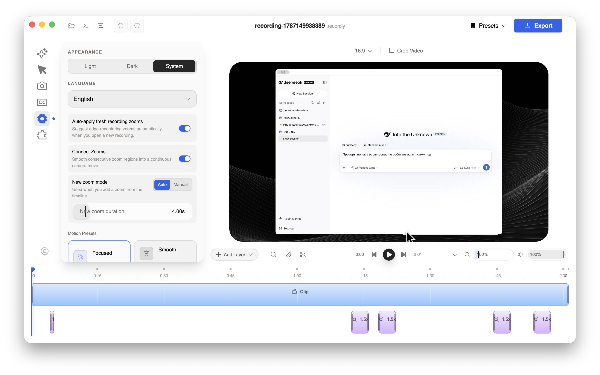
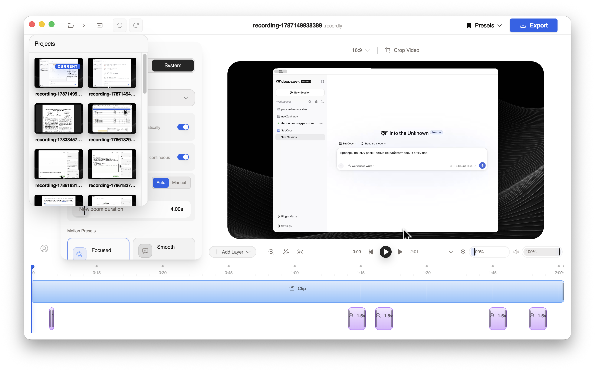
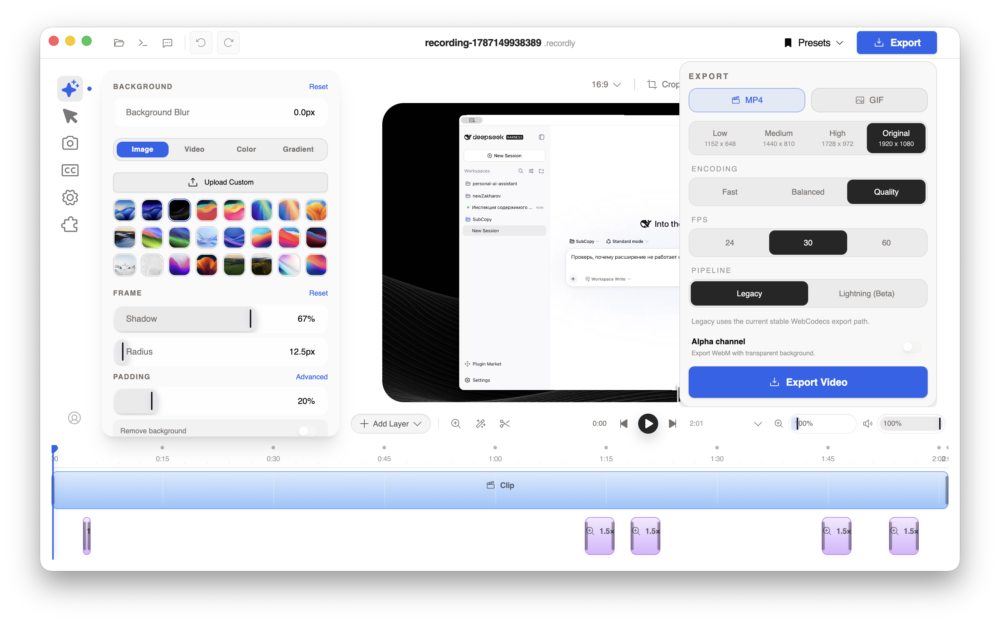
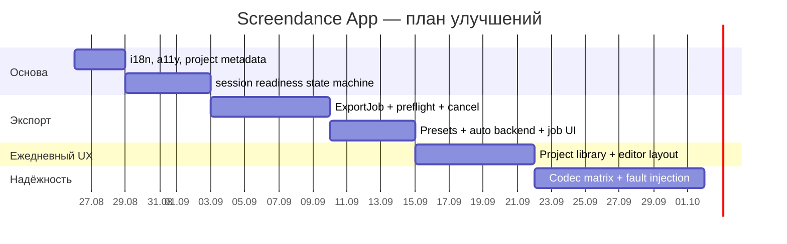

# Аудит UX и медиапайплайнов Screendance App

Дата аудита: 25 августа 2026 года.

## Резюме

Приложение уже умеет заметно больше, чем показывает его пользовательская модель: есть нативная запись, браузерные fallback-пути, отдельные аудиодорожки, два экспортных движка, GIF, MP4, WebM с alpha и ProRes 4444. Главный риск сейчас — техническая сложность видна пользователю, а важные переходные состояния скрыты.

Приоритет улучшений:

1. Сделать запись и экспорт транзакционными: редактор и экспорт не должны работать с ещё не готовыми sidecar-файлами.
2. Превратить экспорт из popover-функции в надёжное задание с preflight, выбранным заранее местом сохранения, ожидаемым размером/временем, корректной отменой и восстановлением.
3. Скрыть выбор внутренних пайплайнов за автоматическим режимом и показывать технические детали только по запросу.
4. Пересобрать библиотеку проектов вокруг названий, времени, длительности, поиска и восстановления, а не технических timestamp-ID.
5. После структурных изменений исправить плотность интерфейса, клавиатурную доступность, focus states, контраст и локализацию.

## Область аудита и ограничения

Проверены:

- HUD запуска, его accessibility-дерево и popover-меню;
- выбор и открытие существующего проекта;
- основной редактор, настройки, таймлайн и библиотека проектов;
- настройки и UI-состояния экспорта;
- renderer-side запись и экспорт;
- Electron IPC, FFmpeg/FFprobe, native/static-layout и ProRes alpha пути;
- отмена, прогресс, fallback, временные файлы и повторное сохранение;
- текущие проверки TypeScript, i18n и целевые тесты.

Ограничения:

- HUD намеренно защищён от screen capture, поэтому снимок этого шага получить нельзя. Его структура проверена через macOS accessibility API.
- Локальный `npm run dev` не открыл Electron: установленный `node_modules/electron` не содержит рабочего бинарника. Визуальный проход выполнен на локальной packaged-сборке, а актуальные незакоммиченные изменения проверялись по исходному коду.
- Реальный длительный экспорт не запускался, чтобы не создавать пользовательские файлы и не менять проекты. Состояния прогресса, отмены и ошибок проверены по коду и тестам.
- Скриншоты позволяют найти вероятные accessibility-риски, но не заменяют полный keyboard/VoiceOver/WCAG-прогон.

## Текущий пользовательский путь

Красные зоны этого пути:

- `D → E` и `D → F` идут параллельно: пользователь может начать работу до готовности всех ресурсов.
- `H → I` требует от пользователя знания внутренней архитектуры.
- место назначения появляется только в `L`, после дорогой работы;
- состояние экспортного задания привязано к popover редактора, а не к самостоятельному job lifecycle.

## Пошаговый UX-аудит

### Шаг 1. Запуск и подготовка записи — требует переработки

HUD компактный, основные кнопки имеют доступные имена. При этом readiness не собран в одном месте: разрешения, выбранный источник, фактически используемый микрофон, system audio и fallback-состояния живут в разных popover и toast. Технически приложение умеет диагностировать захват, но до старта не показывает пользователю единый ответ «что именно будет записано».

Риски:

- системное `alert()` для Accessibility выбивает пользователя из общего визуального языка;
- отдельные разрешения не оформлены как checklist с понятным статусом и действием;
- fallback микрофона может проявиться только после ошибки;
- отмена записи удаляет файл асинхронно и без явного состояния «очистка завершена»;
- проект по умолчанию получает имя вида `recording-1787149938389`.

Снимок отсутствует: окно защищено настройкой `Hide HUD from recording`, из-за чего macOS не включает его в screen capture.

### Шаг 2. Основной редактор — рабочий, но перегруженный

Сильные стороны:

- главный preview остаётся визуальным центром;
- основные группы редактирования разведены по левой панели;
- undo/redo, presets и export находятся в ожидаемом верхнем уровне;
- таймлайн сразу показывает clip и zoom regions.

Проблемы:

- одновременно видны toolbar, inspector, preview controls и высокий таймлайн; рабочая область быстро становится тесной;
- часть важных действий обозначена только иконками, а состояние активного раздела — маленькой синей точкой;
- timeline zoom, preview zoom и volume визуально похожи, но не все имеют доступные имена;
- пользователь не видит статуса autosave/dirty state и готовности фоновых audio/webcam assets;
- старое расширение `.recordly` показывается рядом с техническим названием, хотя новые проекты уже используют `.scrdance`.

### Шаг 3. Настройки — полезные, но смешивают уровни

Настройки темы и языка смешаны с поведением zoom, motion presets и shortcuts. Панель воспринимается как глобальные настройки приложения, но часть значений относится только к созданию новых zoom-регионов. Из-за этого непонятно, что изменится в текущем проекте, а что станет default для следующих.

Accessibility-риски:

- вспомогательный текст визуально мал и имеет слабый контраст;
- некоторые sliders не имеют содержательного `aria-label`;
- project dialog намеренно убирает `focus-visible` ring и не управляет фокусом как модальный диалог;
- timeline items доступны как draggable, но клавиатурная альтернатива не видна.

### Шаг 4. Библиотека проектов — слабое место ежедневного использования

Thumbnail помогает распознавать проекты, но названия обрезаны и почти одинаковы. Хотя backend уже возвращает `updatedAt`, UI его не показывает. Длительность и исходный экран не выводятся, поиск/сортировка/закрепление отсутствуют, список искусственно ограничен первыми 24 элементами.

Следствия:

- после нескольких записей проект приходится узнавать по картинке;
- невозможно быстро найти вчерашнюю запись или длинный проект;
- нет явных действий rename, duplicate, reveal, delete/recover;
- floating dialog визуально перекрывает inspector, но не даёт ожидаемого modal focus behavior.

### Шаг 5. Настройки экспорта — функциональны, но раскрывают внутренности

Положительно: видны реальные размеры, FPS, качество, прогресс, cancel, повторное сохранение без повторного render и `Show in Folder` после успеха.

Основные проблемы:

- `Legacy` и `Lightning (Beta)` — архитектурные термины, а не пользовательские результаты;
- `Fast / Balanced / Quality` не объясняют ожидаемое время, размер или визуальную разницу;
- destination выбирается после render/finalization; до старта нет проверки свободного места и конфликтов имени;
- alpha объединён с MP4-секцией, затем меняет фактический контейнер на MOV/WebM;
- `Safe canvas`, коэффициент canvas и ProRes/WebM требуют профессиональных знаний без preview результата;
- runtime path, native skip reason и просьба сообщать баги смешаны с основным progress UI;
- cancel мгновенно сбрасывает UI до того, как подтверждена остановка всех renderer/main-process ресурсов.

## Риски процессов и транскодирования

### P0. Нет единого состояния готовности записи

`useScreenRecorder` открывает редактор сразу после получения основного видео, а webcam, microphone sidecar и часть mux/rename операций заканчиваются в фоне. Редактор подписывается на обновление session, но экспорт не получает атомарного snapshot всех ресурсов.

Что изменить:

- ввести состояния session: `capturing → stopping → assembling → ready | degraded | failed`;
- хранить manifest ресурсов с версиями и checksum/size/duration;
- разрешать редактирование во время `assembling`, но блокировать export или экспортировать только подтверждённый immutable snapshot;
- показать banner «Дособираем аудио и камеру» с прогрессом и возможностью открыть детали;
- при degraded завершении перечислять отсутствующие дорожки и предлагать retry/relink.

### P0. Экспорт не является самостоятельным заданием

Сейчас job state находится в `VideoEditor`, а cancel синхронно закрывает UI и обнуляет progress. При этом exporter и IPC имеют собственные async cleanup/cancel пути.

Что изменить:

- ввести `ExportJob` в main process: `queued → preflight → rendering → audio → muxing → validating → saving → completed | canceled | failed`;
- каждый job получает ID, immutable project snapshot, destination и temp paths;
- cancel должен быть `await cancel(jobId)` и завершаться только после остановки процессов и удаления/сохранения temp-файлов;
- job остаётся видимым при закрытии popover и переживает закрытие editor window;
- после падения приложения незавершённый job либо возобновляется, либо предлагает безопасную очистку;
- ошибки имеют стабильные codes и действия: `retry`, `choose destination`, `free disk`, `switch encoder`, `open logs`.

### P0. Destination и ресурсы проверяются слишком поздно

Что изменить:

- выбирать путь до render;
- оценивать output size и temp space с запасом;
- проверять writable destination, collision policy и наличие FFmpeg/encoder до запуска;
- создавать reservation/partial file рядом с destination или явно показывать temp location;
- для отменённого save сохранять готовый temp output ограниченное время с понятным countdown.

### P1. Автоматический fallback есть, но UX заставляет выбирать pipeline

Что изменить:

- default UI: presets `Быстро`, `Высокое качество`, `Прозрачный фон`, `GIF`;
- приложение само выбирает render/encode backend по preflight;
- `Legacy` оставить только в `Advanced → Compatibility mode`;
- перед стартом показывать короткий итог: container, codec, resolution, FPS, audio, примерный размер;
- после завершения сохранить technical report в logs, а пользователю показывать его только по кнопке «Детали».

### P1. Alpha/ProRes требует отдельного контракта

Существующий guardrail правильный: MOV, `prores_ks`, `ap4h`, alpha-capable pixel format, FFmpeg vendor `FFMP`, `Lavc`, BT.709, предпочтительно system FFmpeg на macOS. Его нельзя размывать общей настройкой «Alpha channel».

Что изменить:

- отдельный preset `Прозрачное видео` с выбором `Apple / монтаж (ProRes MOV)` и `Web / WebM`;
- preflight system FFmpeg и понятный fallback/блокировка для ProRes;
- post-transcode validation остаётся обязательной;
- автоматический preview checker не должен заменять ручной Quick Look smoke перед релизом;
- regression matrix: portrait/landscape, safe canvas on/off, shadow, webcam, captions, 5 representative frames.

### P1. Монолитные orchestrator-файлы усложняют исправление UX

Шесть ключевых файлов содержат около 22 тысяч строк: `VideoEditor.tsx`, `SettingsPanel.tsx`, `useScreenRecorder.ts`, `modernVideoExporter.ts`, `electron/ipc/export/native-video.ts`, `register/export.ts`. UI state, policy выбора backend, lifecycle и telemetry тесно связаны.

Что изменить:

- вынести `recordingSessionMachine`, `exportJobMachine`, `exportPreflight`, `exportPolicy` и `projectLibraryModel`;
- разделить policy (что выбрать) и mechanism (как кодировать);
- renderer получает нормализованные capabilities и job events, а не принимает решения по множеству feature flags;
- контракт IPC версионировать и покрыть contract tests.

## Что исправить прямо сейчас

### 1–3 дня

1. Исправить `npm run i18n:check` и убрать hardcoded строки из export progress/errors.
2. Показать `updatedAt` и нормальное default-название (`2026-08-25 19-42 — Screen`) в project library; добавить tooltip с полным именем.
3. Добавить видимый autosave/status indicator: `Сохранено`, `Сохраняем…`, `Не удалось сохранить`.
4. Добавить labels для безымянных sliders и вернуть `focus-visible` в project cards.
5. Перенести `Legacy` в Advanced и оставить один автоматический режим по умолчанию.
6. Добавить banner готовности фоновых webcam/mic assets и временно блокировать export до `session.ready`.

### 1 неделя

1. Выбирать destination до render и делать disk/codec preflight.
2. Ввести main-process `ExportJob` с awaitable cancel и централизованной очисткой temp-файлов.
3. Сделать export status постоянным: кнопка/панель задач, которая не исчезает вместе с popover.
4. Добавить task-based export presets и сводку результата перед стартом.
5. Добавить fault-injection тесты: disk full, encoder missing, cancel в каждой фазе, crash/restart, save dialog canceled.

## График изменений

| Период | Результат | Основные задачи | Критерий готовности |
|---|---|---|---|
| Дни 1–3 | Базовая гигиена и доверие | i18n, доступные labels/focus, понятные имена и даты проектов, autosave/readiness status | `tsc`, `i18n:check`, unit tests зелёные; пользователь отличает проекты и видит готовность |
| Неделя 1 | Надёжная запись → редактор | session state machine, manifest ресурсов, degraded/retry UI, export gate | экспорт не стартует с незавершёнными sidecars; recovery сценарии покрыты тестами |
| Неделя 2 | Надёжный export job | destination-first, preflight, disk estimate, main-process job, awaitable cancel, cleanup/recovery | cancel подтверждён на каждой фазе; после crash нет orphaned temp без recovery записи |
| Неделя 3 | Новый экспортный UX | presets, auto backend, Advanced compatibility, постоянная панель progress, actionable errors | пользователь экспортирует без знания Legacy/Lightning; причина fallback доступна в деталях |
| Неделя 4 | Библиотека и редактор | search/sort/rename, duration/date, responsive inspector/timeline, keyboard timeline operations | 100+ проектов остаются находимыми; основные действия доступны с клавиатуры |
| Недели 5–6 | Транскодирование и релизная матрица | MP4/GIF/WebM/ProRes matrix, audio/webcam/captions, fault injection, performance budgets, packaged smoke, Quick Look | все matrix cases валидны; ProRes проходит metadata/alpha/Quick Look guardrail; нет регрессии времени/памяти |

## Предлагаемый backlog

| ID | Приоритет | Изменение | Размер | Зависит от |
|---|---|---|---|---|
| REC-01 | P0 | Session readiness state machine и resource manifest | L | — |
| REC-02 | P0 | Banner assembling/degraded + retry/relink | M | REC-01 |
| EXP-01 | P0 | Main-process ExportJob и IPC events | L | — |
| EXP-02 | P0 | Awaitable cancel, temp cleanup и crash recovery | L | EXP-01 |
| EXP-03 | P0 | Destination-first + disk/codec preflight | M | EXP-01 |
| EXP-04 | P1 | Presets и auto backend policy | M | EXP-01 |
| EXP-05 | P1 | Постоянная панель задач и actionable errors | M | EXP-01 |
| ALPHA-01 | P0 | Сохранить ProRes Quick Look guardrail и matrix tests | M | EXP-01 |
| PRJ-01 | P1 | Читаемые имена, дата, длительность, tooltip | S | — |
| PRJ-02 | P1 | Search/sort/pin/reveal/recover | M | PRJ-01 |
| UI-01 | P1 | Autosave/dirty/readiness status | S | REC-01 |
| UI-02 | P1 | Responsive inspector/timeline workspace | L | — |
| A11Y-01 | P0 | Labels, focus rings, keyboard timeline, contrast | M | — |
| I18N-01 | P0 | Починить parity и убрать hardcoded UI strings | S | — |
| QA-01 | P0 | Fault injection по фазам export/recording | L | REC-01, EXP-01 |
| QA-02 | P1 | Packaged end-to-end smoke и performance budgets | L | EXP-01 |

## Критерии качества процесса

- Никакая fallback-ветка не остаётся бесшумной: пользователь получает результат или понятное degraded-состояние, logs получают техническую причину.
- Каждый export job имеет destination, snapshot, job ID, phase, progress, cancel acknowledgment и cleanup result.
- Любой временный файл принадлежит session/job manifest и имеет TTL/recovery policy.
- Экспортный preset определяет пользовательский результат; backend выбирается policy-слоем.
- Строки интерфейса проходят `npm run i18n:check` в обязательном CI.
- Для ProRes alpha обязательны существующие guardrail-команды из корневого `AGENTS.md` и ручная проверка Quick Look/Finder.
- Перед релизом прогоняются packaged build smoke, длинный проект, portrait, audio speed edits, webcam, captions, cancel и low-disk сценарии.

## Проверки во время аудита

- `npx tsc --noEmit` — успешно.
- 89 целевых тестов export/IPC/ProRes — успешно.
- 53 целевых теста recording/project dirty state — успешно.
- `npm run i18n:check` — ошибка: отсутствуют группы ключей в нескольких локалях, включая native capture dialog, motion presets и alpha export strings.

## Реализовано 25 августа 2026

Первый пакет улучшений из раздела «Что исправить прямо сейчас» внесён в рабочую папку:

- запись передаёт в редактор явное состояние ресурсов `assembling`, `ready` или `degraded`; пока sidecar-аудио/камера собираются, экспорт заблокирован, а состояние видно в шапке редактора;
- проект показывает состояния `Сохранено`, `Есть несохранённые изменения`, `Сохраняем…` и ошибку сохранения;
- библиотека проектов получила поиск, полный список без лимита в 24 элемента, дату изменения, читаемые имена автоматических записей, счётчик результатов, empty state и видимый keyboard focus;
- технический выбор export pipeline перенесён в «Расширенную совместимость»; основной режим называется «Автоматически», а причина временной блокировки экспорта показывается прямо в меню;
- автоматические имена файлов проектов стали файлово-безопасными и различимыми по дате и времени;
- структуры всех локалей синхронизированы с английской локалью; новые пользовательские строки переведены на русский;
- тестовый canvas mock обновлён под viewport-aware annotation rendering.

Проверки этого пакета:

- `npx tsc --noEmit` — успешно;
- `npm run i18n:check` — успешно;
- `npm test -- electron/ipc/nativeVideoExport.test.ts electron/ipc/register/export.test.ts electron/ipc/export/native-video.test.ts` — 89/89 успешно;
- полный `npm test` — успешно;
- Impeccable detector для изменённых экранов — замечаний нет;
- `PACKAGED_SMOKE_ARCH_TAGS=darwin-arm64 npm run smoke:packaged-binaries` — успешно: arm64 FFmpeg, ScreenCaptureKit/cursor helpers и Whisper runtime найдены и запускаются;
- `npm run lint` всё ещё не проходит из-за накопленного baseline: Biome сообщает сотни форматирующих замечаний в ранее изменённых файлах вне этого пакета; изменённые здесь UI-файлы предварительно отформатированы.

Собранная arm64-версия находится в `release/mac-arm64/Screendance App.app` и установлена в `/Applications/Screendance App.app`. Предыдущая установленная версия сохранена как `/Applications/Screendance App.backup-20260825-203355.app`. После копирования новая версия успешно запущена из `/Applications`.

Следующая очередь остаётся прежней: main-process `ExportJob`, destination-first preflight, подтверждаемая отмена с cleanup, recovery и fault-injection matrix. ProRes alpha-настройки этим пакетом не менялись; перед любыми будущими изменениями продолжает действовать guardrail из корневого `AGENTS.md`.
